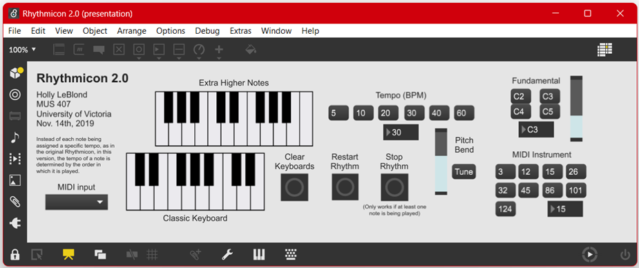

# Rhythmicon 2.0

Max/MSP implementation of Henry Cowell's Rhythmicon instrument that I made for a university assignment back in 2019 (MUS 407 at the University of Victoria).

To use, download the two files in the release, place them in the same folder, and open "Rhythmicon 2.0" in Max.

Have fun!
